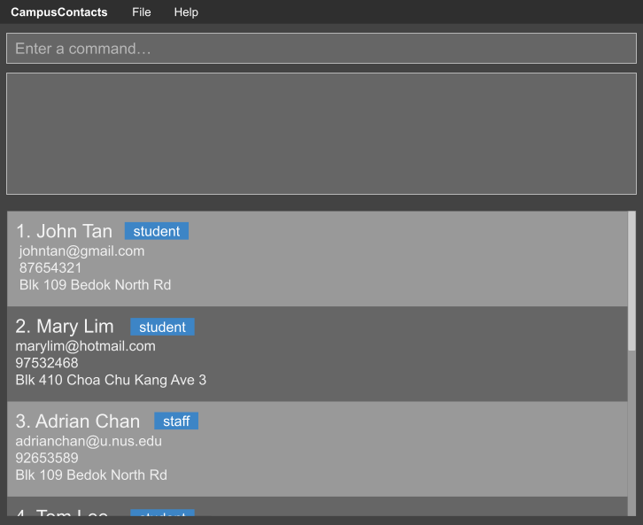

# CampusContacts

**CampusContacts is a desktop application for university students and staff to manage contacts within their university community.**

It helps university students and staff quickly find and identify people they interact with, making it easier to figure out who someone is, where to find them, or how to contact them within the large university community.

## Features

* Add or remove a student/staff and their contact details
* List all contacts
* View a student/staff's contact details
* Edit a contact's details
* Search and filter saved contacts by name, phone number, email or faculty

## Documentation

Detailed documentation of this project can be found at the [CampusContacts product website](https://ay2627s1-cs2103t-w14-1.github.io/tp).

## Acknowledgements

This project is based on the AddressBook-Level3 project created by the [SE-EDU initiative](https://se-education.org).
