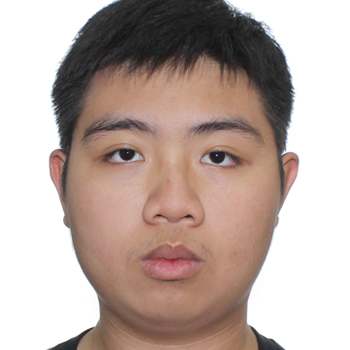
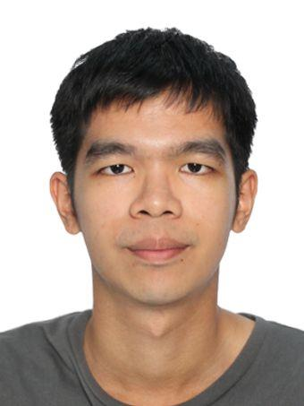
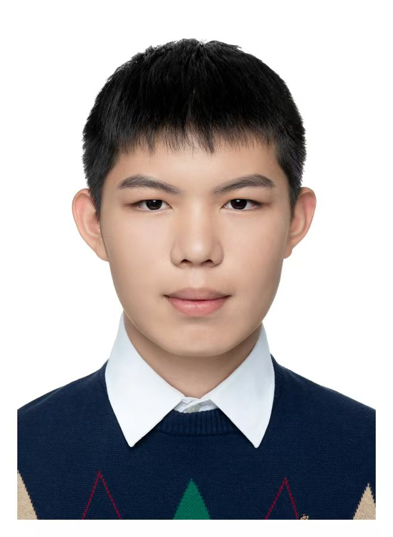
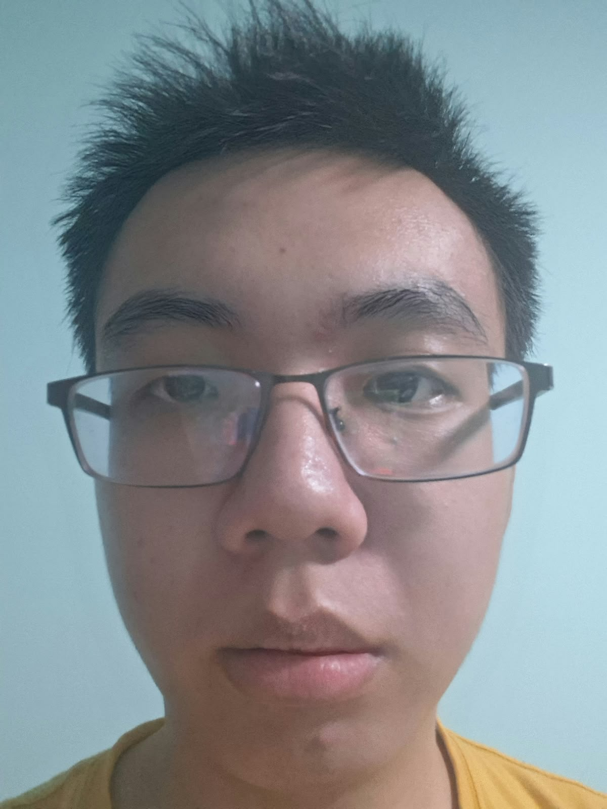
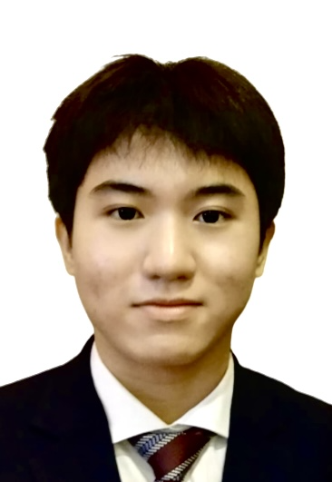

[//]: # (---)

[//]: # (  layout: default.md)

[//]: # (    title: "About Us")

[//]: # (---)

# About Us

We are a team based in the [School of Computing, National University of Singapore](http://www.comp.nus.edu.sg).

You can reach us at the email `seer[at]comp.nus.edu.sg`

## Project team

### Aleron Tham

[[github](http://github.com/unoptimalsuperstructure)]

- Role: Developer
- Responsibilities: Coding (duh.)

### Lo Yong Yang

[[github](https://github.com/scoot1234)]

- Role: Team Lead
- Responsibilities: To code & to lead(?)

### Meng Yuxuan (Enzo Meng)

[[homepage](https://www.linkedin.com/in/yuxuan-meng-a284813b9/)] [[github](http://github.com/Enzo-MYX)] [portfolio (non-existent atm)]

- Role: Developer
- Responsibilities: Coding (duh.)

### Tang Xinchen

[[github](http://github.com/Ciltan)]

- Role: Developer
- Responsibilities: Coding

### Lim Zi Chao

[[github](https://github.com/lzc-nus)]
<!-- [[portfolio](team/lzc-nus.md)] -->

- Role: Developer
- Responsibilities: Coding
